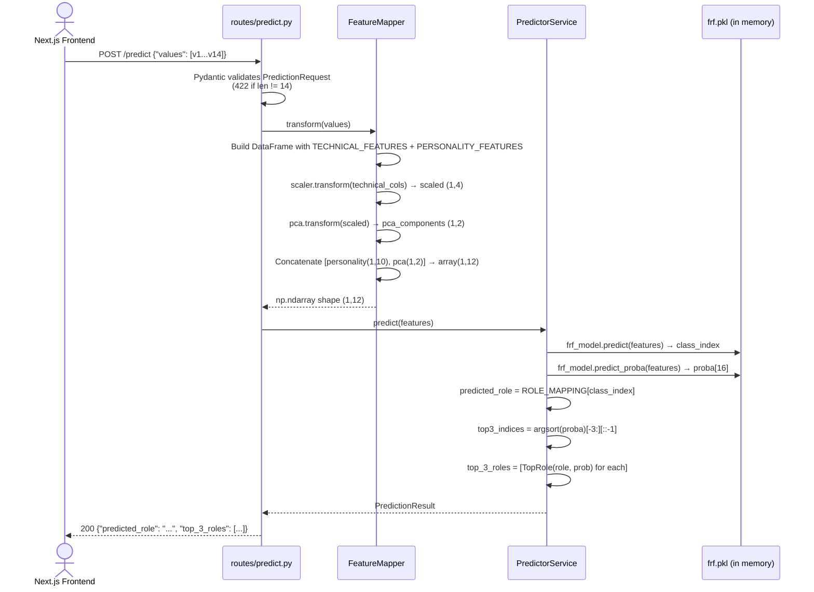
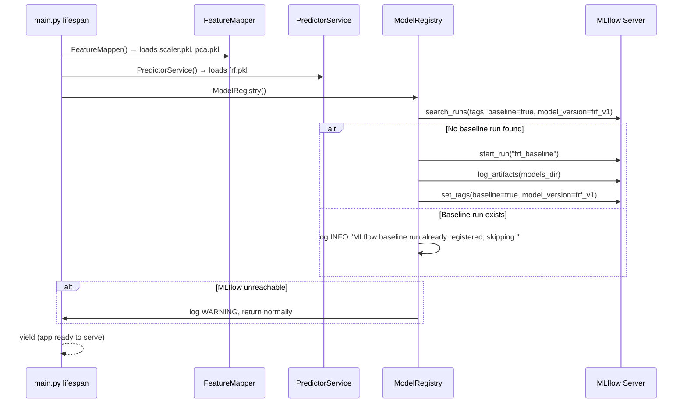

# Design Document — FastAPI Backend Refactor

## Overview

The current FastAPI backend is a single-file monolith (`main.py`) that loads ML models, applies feature transformations, runs inference, and exposes HTTP routes all in one place. This refactor breaks that file apart into a layered service architecture without changing any prediction logic, model accuracy, or the external API contract that the Next.js frontend depends on.

The end state is a clean separation between HTTP routing, business services, data schemas, and configuration constants. Two new services (`FeatureMapper`, `PredictorService`) extract the ML pipeline steps. A third service (`ModelRegistry`) adds MLflow baseline logging on startup. A stub `AgentOrchestrator` creates the extension seam for upcoming phases (resume parsing, RAG, career advisor). `main.py` becomes purely wiring.

**Key constraints carried through the entire design:**
- `frf.pkl`, `scaler.pkl`, `pca.pkl` stay in `backend/fastapi/models/` — no file moves.
- All model loading paths default to `backend/fastapi/models/` but accept an optional `models_dir` override for test isolation.
- `POST /predict` input/output contract is backward-compatible. `top_3_roles` is an additive field.
- No changes to prediction logic, feature math, or trained model weights.

---

## Architecture

### Directory Structure

```
backend/fastapi/
├── app/
│   ├── __init__.py
│   ├── main.py                         # App wiring only: FastAPI instance, CORS, lifespan, router mounts
│   ├── config/
│   │   └── constants.py                # ROLE_MAPPING, TECHNICAL_FEATURES, PERSONALITY_FEATURES
│   ├── routes/
│   │   └── predict.py                  # APIRouter: POST /predict, GET /
│   ├── schemas/
│   │   └── prediction.py               # PredictionRequest, TopRole, PredictionResult (Pydantic)
│   ├── services/
│   │   ├── feature_mapper.py           # FeatureMapper: scaler + PCA pipeline
│   │   ├── predictor.py                # PredictorService: model inference
│   │   ├── model_registry.py           # ModelRegistry: MLflow baseline logging
│   │   └── agent_orchestrator.py       # AgentOrchestrator: stub for future phases
│   └── utils/                          # Shared utilities (empty for now; reserved)
├── models/
│   ├── frf.pkl                         # DO NOT MOVE
│   ├── scaler.pkl                      # DO NOT MOVE
│   └── pca.pkl                         # DO NOT MOVE
├── tests/
│   ├── conftest.py                     # Shared fixtures: models_dir, data path, sample rows
│   ├── test_feature_mapper.py
│   └── test_predictor_service.py
└── requirements.txt
```

### Layered Call Flow

```
HTTP Request
     │
     ▼
routes/predict.py  (Router)
     │  delegates feature transformation
     ▼
services/feature_mapper.py  (FeatureMapper)
     │  returns np.ndarray (1, 12)
     ▼
services/predictor.py  (PredictorService)
     │  returns PredictionResult
     ▼
routes/predict.py  (Router)
     │  serialises via Pydantic
     ▼
HTTP Response
```

`main.py` owns startup/shutdown via a lifespan context manager, which triggers `ModelRegistry` to log the MLflow baseline run (once, idempotently).

---

## Components and Interfaces

### `config/constants.py`

A pure-constants module. No classes, no runtime logic.

```python
TECHNICAL_FEATURES: list[str] = [
    "Computer Architecture",
    "Programming Skills",
    "Project Management",
    "Communication skills",
]

PERSONALITY_FEATURES: list[str] = [
    "Openness",
    "Conscientousness",
    "Extraversion",
    "Agreeableness",
    "Emotional_Range",
    "Conversation",
    "Openness to Change",
    "Hedonism",
    "Self-enhancement",
    "Self-transcendence",
]

ROLE_MAPPING: dict[int, str] = {
    0: "Database Administrator",
    1: "Hardware Engineer",
    2: "Application Support Engineer",
    3: "Cyber Security Specialist",
    4: "Networking Engineer",
    5: "Software Developer",
    6: "API Specialist",
    7: "Project Manager",
    8: "Information Security Specialist",
    9: "Technical Writer",
    10: "AI ML Specialist",
    11: "Software Tester",
    12: "Business Analyst",
    13: "Customer Service Executive",
    14: "Helpdesk Engineer",
    15: "Graphics Designer",
}
```

All other modules that need these values import from here. No inline redefinition anywhere else.

---

### `services/feature_mapper.py` — `FeatureMapper`

Owns the scaler + PCA transformation pipeline. Stateless after construction.

```python
class FeatureMapper:
    def __init__(self, models_dir: str = "backend/fastapi/models/") -> None:
        """
        Loads scaler.pkl and pca.pkl from models_dir.
        Raises FileNotFoundError if either file is missing.
        """

    def transform(self, values: list[float]) -> np.ndarray:
        """
        Accepts exactly 14 raw float values in the canonical feature order:
          [Computer Architecture, Programming Skills, Project Management,
           Communication skills,
           Openness, Conscientousness, Extraversion, Agreeableness,
           Emotional_Range, Conversation, Openness to Change, Hedonism,
           Self-enhancement, Self-transcendence]

        Returns np.ndarray of shape (1, 12):
          - 10 personality features (indices 4–13, unscaled)
          - 2 PCA components derived from the 4 scaled technical features

        Raises ValueError if len(values) != 14.
        """
```

**Design decisions:**
- `models_dir` defaults to the canonical path so production code requires zero configuration, but tests pass a fixture path via the parameter.
- The output column order is `[personality_features..., PCA_1, PCA_2]`, matching the column order that `frf.pkl` was trained on (derived by inspecting the existing `main.py` pipeline).
- `transform` is a pure function after construction: same inputs always produce the same outputs, which makes it directly property-testable.

---

### `services/predictor.py` — `PredictorService`

Owns model loading and inference. Depends on `ROLE_MAPPING` from constants.

```python
class PredictorService:
    def __init__(self, models_dir: str = "backend/fastapi/models/") -> None:
        """
        Loads frf.pkl from models_dir.
        Raises FileNotFoundError (with path in message) if the file is missing.
        """

    def predict(self, features: np.ndarray) -> PredictionResult:
        """
        Accepts a NumPy array of shape (1, 12) produced by FeatureMapper.

        Returns PredictionResult:
          - predicted_role: str  — top-1 class name from ROLE_MAPPING
          - top_3_roles: list[TopRole]  — 3 highest-probability roles, sorted descending

        Uses frf_model.predict() for predicted_role.
        Uses frf_model.predict_proba() for top_3_roles.
        """
```

**Design decisions:**
- `PredictorService` does not import or instantiate `FeatureMapper`; it receives an already-transformed array. This keeps the two responsibilities independently testable and swappable.
- `predict_proba` returns probabilities for all 16 classes; `top_3_roles` takes `np.argsort(proba)[-3:][::-1]` to get the 3 highest in descending order.
- If `frf.pkl` is missing, the error surfaces at construction time (during startup), not at request time.

---

### `services/model_registry.py` — `ModelRegistry`

Handles MLflow baseline registration. Runs once at application startup.

```python
class ModelRegistry:
    def __init__(
        self,
        models_dir: str = "backend/fastapi/models/",
        experiment_name: str | None = None,
    ) -> None:
        """
        experiment_name defaults to os.environ.get("MLFLOW_EXPERIMENT_NAME", "career-prediction").
        """

    def register_baseline_if_needed(self) -> None:
        """
        1. Sets or creates the MLflow experiment by name.
        2. Searches for existing runs with tags baseline=true, model_version=frf_v1.
        3. If none found: starts a new run named "frf_baseline", logs the three .pkl
           artifacts from models_dir, sets tags baseline=true, model_version=frf_v1.
        4. If found: logs INFO "MLflow baseline run already registered, skipping."
        5. If MLflow raises any exception: logs WARNING with the error and returns.
           The application continues starting up normally.
        """
```

**Design decisions:**
- `register_baseline_if_needed` is idempotent: running it twice has no additional effect beyond the first call.
- All MLflow I/O is wrapped in a broad `except Exception` that degrades to a WARNING log, so a missing MLflow server never prevents the API from serving predictions.
- `models_dir` override enables tests to point at a temp directory without touching the real model files.

---

### `services/agent_orchestrator.py` — `AgentOrchestrator`

A stub that creates the structural seam for future phases.

```python
class AgentOrchestrator:
    """
    Placeholder for the AI agent orchestration layer.

    Future responsibilities:
    - Coordinating resume parsing pipeline
    - Invoking RAG retrieval against career knowledge base
    - Orchestrating the AI career advisor agent workflow
    """

    def __init__(self) -> None:
        pass

    def run(self, *args, **kwargs):
        raise NotImplementedError("AgentOrchestrator is not yet implemented.")
```

No functional logic in this phase. The stub is importable and its interface is intentionally minimal to avoid committing to an API before requirements are defined.

---

### `routes/predict.py` — Router

A lightweight FastAPI `APIRouter`. Delegates all business logic to services.

```python
router = APIRouter()

@router.get("/")
def health_check() -> dict:
    return {"message": "Backend running"}

@router.post("/predict", response_model=PredictionResult)
def predict_career(data: PredictionRequest) -> PredictionResult:
    """
    Delegates to FeatureMapper.transform → PredictorService.predict.
    Returns PredictionResult (includes both predicted_role and top_3_roles).
    HTTP 422: automatic for invalid PredictionRequest (Pydantic validation).
    HTTP 500: caught via exception handler; returns {"detail": "Internal prediction error"}.
    """
```

**Design decisions:**
- The router does not instantiate services directly. Service instances are injected via FastAPI's dependency injection (`Depends`) or held as module-level singletons set during the lifespan startup. The lifespan approach is used here to align with requirement 5.4 and to avoid importing model files before startup.
- `response_model=PredictionResult` ensures Pydantic serializes the output and strips any unexpected fields.
- A global exception handler registered in `main.py` catches unhandled exceptions and returns the 500 response, keeping the router clean.

---

### `main.py` — Application Wiring

```python
from contextlib import asynccontextmanager
from fastapi import FastAPI, Request
from fastapi.middleware.cors import CORSMiddleware
from fastapi.responses import JSONResponse
from app.routes.predict import router
from app.services.model_registry import ModelRegistry
from app.services.feature_mapper import FeatureMapper
from app.services.predictor import PredictorService

@asynccontextmanager
async def lifespan(app: FastAPI):
    # Startup
    app.state.feature_mapper = FeatureMapper()
    app.state.predictor = PredictorService()
    registry = ModelRegistry()
    registry.register_baseline_if_needed()
    yield
    # Shutdown (nothing to clean up in this phase)

app = FastAPI(lifespan=lifespan)

app.add_middleware(
    CORSMiddleware,
    allow_origins=["http://localhost:3000"],
    allow_credentials=True,
    allow_methods=["*"],
    allow_headers=["*"],
)

@app.exception_handler(Exception)
async def global_exception_handler(request: Request, exc: Exception):
    return JSONResponse(status_code=500, content={"detail": "Internal prediction error"})

app.include_router(router)
```

`main.py` contains no `import joblib`, no `import numpy`, no `import pandas`, and no inline ML logic. All of those live in the service layer.

---

## Data Models

All schemas live in `backend/fastapi/app/schemas/prediction.py`.

```python
from pydantic import BaseModel, field_validator

class PredictionRequest(BaseModel):
    values: list[float]

    @field_validator("values")
    @classmethod
    def must_have_14_values(cls, v: list[float]) -> list[float]:
        if len(v) != 14:
            raise ValueError(f"Expected exactly 14 values, got {len(v)}")
        return v


class TopRole(BaseModel):
    role: str
    probability: float


class PredictionResult(BaseModel):
    predicted_role: str       # top-1 prediction — same key the frontend reads
    top_3_roles: list[TopRole]  # additive field; frontend ignores it (backward-compatible)
```

### Field semantics

| Field | Type | Notes |
|---|---|---|
| `values` | `list[float]` | Exactly 14 numbers, canonical feature order |
| `predicted_role` | `str` | Existing frontend contract key — must not change |
| `top_3_roles` | `list[TopRole]` | New additive field; 3 entries, sorted by probability descending |
| `role` | `str` | Human-readable role name from `ROLE_MAPPING` |
| `probability` | `float` | Value in `[0.0, 1.0]` from `predict_proba` |

### Why Pydantic for PredictionResult?

`PredictionRequest` must be Pydantic because FastAPI parses HTTP request bodies with it. `PredictionResult` is also Pydantic so the `response_model=PredictionResult` annotation on the router handles serialization and field filtering automatically. Using a consistent model type across request/response reduces the number of conversion steps.

---

## Sequence Diagram — POST /predict End-to-End



**Startup flow (lifespan, runs once before any requests):**



---

## MLflow Integration

### Approach

MLflow is used exclusively for **experiment tracking and artifact archiving**, not for model serving. The existing prediction logic uses `joblib.load` from the local filesystem, which is preserved unchanged.

### Experiment naming

- Experiment name: `MLFLOW_EXPERIMENT_NAME` env var, default `"career-prediction"`.
- Run name: `"frf_baseline"`.
- Tags: `{"baseline": "true", "model_version": "frf_v1"}`.

### What gets logged

On the first startup (no existing baseline run):
- Artifacts: `frf.pkl`, `scaler.pkl`, `pca.pkl` (logged with `mlflow.log_artifacts(models_dir)`)
- Tags: `baseline=true`, `model_version=frf_v1`
- No metrics, no parameters in this phase (those come when retraining is introduced)

### Idempotency

`ModelRegistry.register_baseline_if_needed` queries `mlflow.search_runs` with a filter on tags before creating a new run. If a matching run is found, it skips. This means restarting the server repeatedly does not accumulate duplicate runs.

### Graceful degradation

MLflow is optional infrastructure. If the MLflow tracking URI is unreachable (e.g., during local development without a server), the `except Exception` block in `register_baseline_if_needed` catches the error, logs a `WARNING`, and returns. The FastAPI application continues starting and the `POST /predict` endpoint works normally. No part of the prediction path depends on MLflow availability.

### MLflow tracking URI

Not hardcoded. Relies on the MLflow default behaviour: if `MLFLOW_TRACKING_URI` is set, MLflow uses it; otherwise it falls back to a local `./mlruns` directory. This requires no additional configuration for local development.

---

## Error Handling

| Scenario | Where caught | Response |
|---|---|---|
| `values` length ≠ 14 | Pydantic `field_validator` on `PredictionRequest` | HTTP 422 with validation detail |
| `FeatureMapper` gets wrong-length input (defensive) | `FeatureMapper.transform` raises `ValueError` | Propagates to global handler → HTTP 500 |
| `frf.pkl` missing at startup | `PredictorService.__init__` raises `FileNotFoundError` | App fails to start (intentional — cannot serve predictions without model) |
| `scaler.pkl` / `pca.pkl` missing at startup | `FeatureMapper.__init__` raises `FileNotFoundError` | App fails to start |
| MLflow unavailable at startup | `ModelRegistry.register_baseline_if_needed` catches `Exception` | WARNING logged; app starts normally |
| Unhandled exception in prediction route | Global exception handler in `main.py` | HTTP 500 `{"detail": "Internal prediction error"}` |

The principle: failures in the ML prediction path that could produce incorrect results (missing model files) are hard failures at startup. Failures in observability/logging (MLflow) are soft failures that degrade gracefully.

---

## Testing Strategy

### Framework

`pytest` for all tests. Tests run from `backend/fastapi/` without a live server or external services.

```
backend/fastapi/tests/
├── conftest.py                  # Shared fixtures
├── test_feature_mapper.py       # FeatureMapper unit tests
└── test_predictor_service.py    # PredictorService unit tests
```

HTTP-layer tests use FastAPI's `TestClient` (from `starlette.testclient`), which runs the ASGI app in-process without requiring a running server.

### Path resolution strategy

All tests resolve paths relative to the test file using `pathlib`:

```python
# conftest.py
import pathlib

TESTS_DIR = pathlib.Path(__file__).parent
REPO_ROOT = TESTS_DIR.parent.parent.parent.parent  # workspace root
MODELS_DIR = str(REPO_ROOT / "backend" / "fastapi" / "models")
DATA_PATH  = str(REPO_ROOT / "data" / "CareerMapping1.csv")
```

This approach is portable across machines and CI environments without environment variables.

### `conftest.py` fixtures

```python
@pytest.fixture(scope="session")
def models_dir() -> str: ...          # resolved MODELS_DIR string

@pytest.fixture(scope="session")
def sample_rows() -> pd.DataFrame:    # loads first 10 rows from CareerMapping1.csv
    return pd.read_csv(DATA_PATH).head(10)

@pytest.fixture(scope="session")
def feature_mapper(models_dir) -> FeatureMapper:
    return FeatureMapper(models_dir=models_dir)

@pytest.fixture(scope="session")
def predictor_service(models_dir) -> PredictorService:
    return PredictorService(models_dir=models_dir)
```

`scope="session"` means model files are loaded once per test run, not once per test. This keeps the suite fast.

### `test_feature_mapper.py`

- **Smoke test**: `FeatureMapper(models_dir=models_dir)` instantiates without error.
- **Shape assertion on real CSV rows**: for each row in `sample_rows`, extract the 14 feature values, call `transform`, and assert the output shape is `(1, 12)`.
- **ValueError on wrong-length input**: call `transform` with a list of 13 values and assert `ValueError` is raised; repeat with 15 values.

```python
def test_feature_mapper_smoke(models_dir):
    mapper = FeatureMapper(models_dir=models_dir)
    assert mapper is not None

def test_feature_mapper_output_shape(feature_mapper, sample_rows):
    feature_cols = TECHNICAL_FEATURES + PERSONALITY_FEATURES
    for _, row in sample_rows.iterrows():
        values = row[feature_cols].tolist()
        result = feature_mapper.transform(values)
        assert result.shape == (1, 12)

def test_feature_mapper_rejects_wrong_length(feature_mapper):
    with pytest.raises(ValueError):
        feature_mapper.transform([0.5] * 13)
    with pytest.raises(ValueError):
        feature_mapper.transform([0.5] * 15)
```

### `test_predictor_service.py`

- **Smoke test**: `PredictorService(models_dir=models_dir)` instantiates without error.
- **`predicted_role` is a valid role name**: call `predict` with a mapped CSV row and assert the result is a member of `ROLE_MAPPING.values()`.
- **`top_3_roles` has exactly 3 entries with probabilities in `[0.0, 1.0]`**: for each of the 3 entries assert `0.0 <= probability <= 1.0`.
- **`FileNotFoundError` on bad `models_dir`**: assert that `PredictorService(models_dir="/nonexistent/path")` raises `FileNotFoundError`.

```python
def test_predictor_service_smoke(models_dir):
    service = PredictorService(models_dir=models_dir)
    assert service is not None

def test_predicted_role_is_valid(feature_mapper, predictor_service, sample_rows):
    feature_cols = TECHNICAL_FEATURES + PERSONALITY_FEATURES
    row = sample_rows.iloc[0]
    features = feature_mapper.transform(row[feature_cols].tolist())
    result = predictor_service.predict(features)
    assert result.predicted_role in ROLE_MAPPING.values()

def test_top_3_roles_structure(feature_mapper, predictor_service, sample_rows):
    feature_cols = TECHNICAL_FEATURES + PERSONALITY_FEATURES
    row = sample_rows.iloc[0]
    features = feature_mapper.transform(row[feature_cols].tolist())
    result = predictor_service.predict(features)
    assert len(result.top_3_roles) == 3
    for entry in result.top_3_roles:
        assert 0.0 <= entry.probability <= 1.0

def test_predictor_service_bad_models_dir():
    with pytest.raises(FileNotFoundError):
        PredictorService(models_dir="/nonexistent/path")
```

### HTTP-layer tests (FastAPI `TestClient`)

```python
from starlette.testclient import TestClient
from app.main import app

client = TestClient(app)

def test_predict_valid_input_returns_200():
    payload = {"values": [5, 7, 6, 8, 0.6, 0.7, 0.5, 0.8, 0.4, 0.6, 0.7, 0.3, 0.5, 0.6]}
    response = client.post("/predict", json=payload)
    assert response.status_code == 200
    body = response.json()
    assert "predicted_role" in body
    assert "top_3_roles" in body
    assert len(body["top_3_roles"]) == 3

def test_predict_wrong_length_returns_422():
    payload = {"values": [1.0, 2.0, 3.0]}   # only 3 values
    response = client.post("/predict", json=payload)
    assert response.status_code == 422
```

### What is NOT tested by this suite

- MLflow integration (requires live or mocked MLflow server — integration test territory)
- AgentOrchestrator (stub — only smoke test for `NotImplementedError`)
- Frontend/backend integration (out of scope for this phase)
